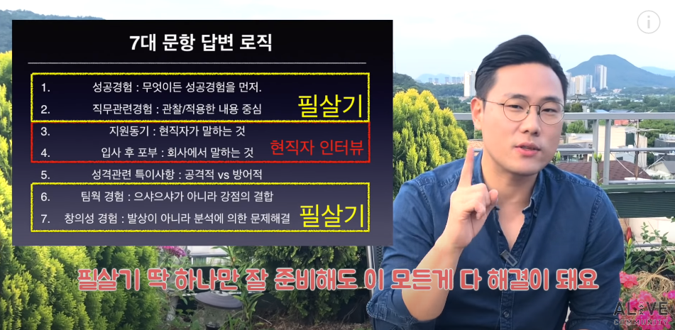

#### 흥미/관심사가 무엇인가요?

- 몰입할 수 있는 사람인가? 경험을 묻는 것이다.
- 몰입해서 목표를 달성했던 경험, 성공했던 경험이 있는지 설명하면 된다.
- 진짜 흥미가 궁금한 것이 아니다.

```
[경험1 : 직무]
도커, 컨테이너에 관심이 있어 현재 국비 교육 과정을 듣고 있습니다.
IT 시사논의에서 MSA와 네트워크 장비의 소프트웨어화에 대해 다루었고, 이를 통해 개발의 효율성을 높여주는 기술이라고 생각해 관심을 가졌습니다.
이러한 기술을 타인에게 설명할 수 있을만큼 알고싶어서 이론에 관해 조사했고, 인프런이라는 인터넷 강의 사이트에서 실습 강의를 들으며 기술을 직접 다루어보았습니다. 그리고 이를 활용해 프로젝트를 진행할 수 있을 만큼 능력을 쌓고 싶어져서 멀티캠퍼스에서 진행하는 클라우드 MSA 국비 교육 과정을 듣고 있습니다.

[경험2 : 취미]
저는 무대 영상을 보며 분석하고 구상하는 것을 좋아합니다.
그래서 팀을 구성하여 '내 생에 가장 피곤한 순간은 매순간이다.'를 주제로 영상을 제작해 29초 영화제에 참여했고, 일반부 우수상을 수상한 경험이 있습니다.
영상 촬영에 흥미가 있어하던 선배와 함께 짧은 영상을 제작해보려 했었고, 공모전에 참여한다면 더욱 흥미가 있을 것 같아서 팀을 구성해 참여하게 되었습니다.
```


---


#### 열정(도전형) vs 꼼꼼 어떤걸 어필해야 좋은 걸까?

- 자신의 성향에 맞춰 어필하면 된다.
- 직무적 강점이 있으면 된다.
- 성과는 직무의 강점으로 내는 것이지 성향으로 내는 것이 아니기 때문이다.
- `필살기 : 직무 유사 경험 > 작아도 성공 경험 > 그 안에서 얻은 통찰, 인사이트`, 필살기를 바탕으로 `입사 후에도 나는 이러한 성공을 다시 이룰 수 있다`는 것을 어필하는 것이 중요하다. 이것이 좋은 인상과 전달력을 만드는 것이다.

```
다른 사람과의 관계에서 에너지를 얻는 외향형 (적극적, 도전적)이 있고, 혼자 있을 때 에너지를 받는 내향형도 있다.
이런 내향형도 사교성이라는 직무적 강점으로 업무를 수행할 때는 적극적이고 외향형으로 바뀔 수 있다.
그래서 다른 사람이 보기에는 비전을 제시하고 이끄는 모습만 보아서 외향적으로 비춰질 수 있다.
직무의 성과는 이러한 강점으로 내는 것이므로 자신의 성향을 감추고 이야기 할 필요는 없다.
```


---


#### 현직자 인터뷰

- 직무면접
  - 현직자 인터뷰는 직무 면접 전에 꼭 하는 것이 좋다.
  - 직무면접은 지원자에게 다음의 내용을 알고싶어 한다.
    1. 직무와 산업에 대한 이해가 있는가
    2. 직무 강점이 있는가


- 현직자 인터뷰
  - 이유 : 회사의 경쟁력을 찾기 위한 것이다.
  - 필수 질문
    1. 시장에서의 위치는 어떻고, 이 회사의 경쟁력은 무엇인가?
    2. 경쟁사는 어디이고 우리 회사의 차별점은 무엇인가? (경쟁사가 이 회사의 레벨을 정한다.)
    3. 당신이 이 기업에 다니는 이유와 앞으로의 성장 계획은? EVP, Employee Value Proposition (회사가 직원들을 위해 다양한 것들을 제공)
    4. 회사에서 어떤 사람이 인정받는가?


- 주의할 점
  - 면접을 앞두고 있다는 말은 하지 말 것
  - 현직자의 시야와 관점을 얻는 것이 목표다, 정답을 요구하지 말 것
  - 한두명만 조사하지 말고 최대한 많이 만날 것
  - 경쟁사 현직자도 만나 볼 것


---


#### 마지막 할 말

- 굳이 하지 않아도 된다.
- 할 것이라면 **감사 인사**를 전하면 된다.
- 면접을 망친 것 같다면, 자기소개에서 던졌던 자신의 필살기를 한 번 더 던져보는 것도 좋다.

```
현직자 인터뷰, 기업분석, 산업분석, 고객조사 등을 통해 면접을 준비하여며 ~~한 것들을 배우게 되었습니다. 이러한 배움과 면접의 기회를 주셔서 감사합니다.
```

<u>이 시점이 되면 지원자에 대한 판단은 거의 끝났다.</u>
회사는 지원자에게 좋은 이미지를 보이고 싶어한다.
합격자라면 로열티를 위해, 탈락자라면 고객으로서 계속 회사에 긍정적이기를 바라기 때문이다.
이 질문도 그러한 면에서 던지는 질문이다.

마지막 할 말에서 필살기를 보여주려 하는 사람도 있는데 좋지 못한 생각이다.
면접관은 구조화된 면접을 진행하는데, 마지막 필살기는 면접관의 판단을 혼란스럽게 한다.
<u>면접은 면접관이 예측 가능하도록 이야기하는 것이 좋다.</u>
면접은 내가 생각한 방향으로 흘러가지 않을 수도 있으므로 <u>중요한 내용은 앞에서 다 이야기 해야한다.</u>


---


#### 면접 필수 7대 문항

성공경험 / 직무관련경험 / 지원동기 / 입사 후 포부 / 성격관련 특이사항 / 팀웍 경험 / 창의성 경험

필살기를 여러개 준비해야 한다!




---


#### 정보를 찾기 어려운 곳의 지원동기는?

- 현직자 인터뷰
  - 지원동기 작성을 위한 돌파전략
  - 지원동기는 보통 `1.직무 / 2.산업 / 3.직장`이 있고, `2`, `3`은 현직자 인터뷰로 가능하다.
- 현직자를 만나기 어려운 경우에는? `1`번, **직무 지원 동기**로 퉁치자!
- 지원동기, 입사 후 포부 역시 **직무 지원 동기**와 연결에 쓰면 된다.

```
내가 지금까지 ~일을 잘했고, ~한 강점이 있다.
이 회사는 ~한 것들을 잘 하기 때문에 내가 입사한다면 ~한 부분에서 잘 할 수 있을 것이다.
```